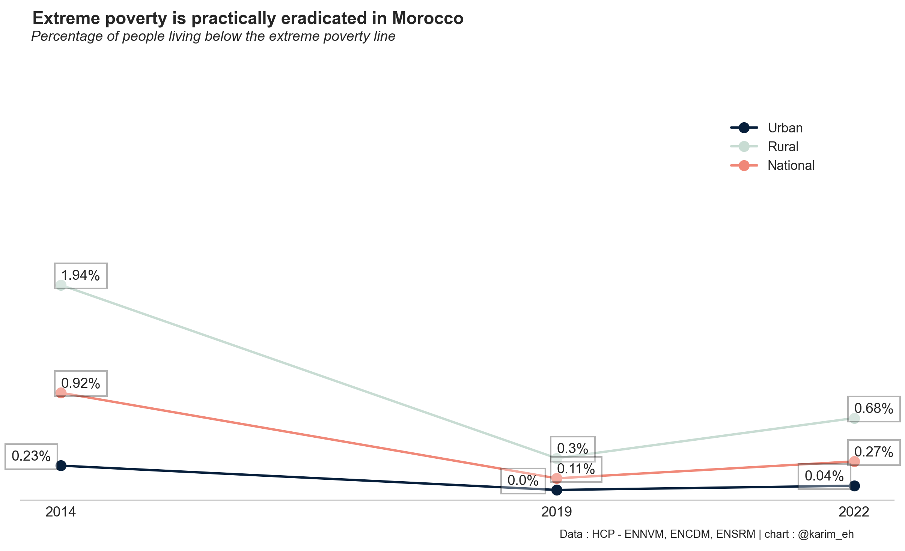

### TL;DR

Le HCP a publié la synthèse des résultats de l'Enquête Nationale sur le Niveau de Vie des Ménages (ENNVM 2022). Ces dernières montrent globalement trois tendances lourdres:

1. **Le Maroc a globalement réussi à éradiquer la forme la plus extrême de pauvreté** (dite pauvreté extrême), passée de 2% en 2014, à moins de 0,7% en 2022. Dans le milieu urbain, elle est même quasiment inexistante (0,04%).
2. Plus que jamais, **les Marocains ont accès aux services publics de base**. La Pauvreté Multidimensionnelle, qui mesure le niveau de revenu ainsi que l'accès aux services publics de base (éducation, eau potable, assainissement, santé) est passée de 40% en 2001 à 6% en 2022.
3. **La pauvreté monétaire repart fortement à la hausse depuis 2019**. Le nombre d'individus pauvres ou vulnérables à la pauvreté est passé de 3,2 à 6,2 millions.

### Contexte : des données rares et obsolètes

Les chiffres discutés ici sont issus de l'Enquête Nationale sur le Niveau des Ménages (ENNVM-2022), que le HCP mène pour la première fois depuis 2007. Les données de comparaisons historiques sont issues de l'ENCDM* en 2001 et 2014, de l'ENNVM en 2007 et 2022, et de l'ENSRM** en 2019.

| Année | ENNVM | ENCDM | ENSRM |
| :----: | :---: | :---: | :---: |
|  2001  |      |   X   |      |
|  2007  |   X   |      |      |
|  2014  |      |   X   |      |
|  2019  |      |      |   X   |
|  2022  |   X   |      |      |

*Table 1 : Sources hétérogènes des données*

Seule la synthèse de l'enquête a été publiée pour le moment. Les résultats seront publiés prochainement.

La dispertion et l'irrégularité dans la collecte de données ne permet pas une lecture précise de ces chiffres. Il est, par exemple, impossible d'isoler l'impact du COVID-19 de celui de l'inflation. De même, il est impossible d'évaluer avec précision l'impact des politiques publiques et des changement de gouvernements.

De plus, le retard dans la publication des résultats amplifie ces problèmes. L'ENNVM s'est déroulée entre mars 2022 et mars 2023. Qu'est-ce qui justifie une publication aussi tardive (15 mois !) même pour une simple synthèse de ses résultats ? Les méthodes de collecte de données pour les enquêtes ont considérablement évolué. Les enquêtes modernes utilisent de plus en plus des tablettes numériques pour recueillir des informations, ce qui facilite non seulement la saisie des données mais aussi leur traitement ultérieur. La taille de l'échantillon (18000 ménages) ne justifie pas non plus ces délais.

Ces pratiques du HCP nous obligent à nous contenter d'une analyse approximative et potentiellement obsolète des données.

### 1. La pauvreté extrême est éradiquée

Les chiffres de l'ENNVM 2022 confirment ceux des enquêtes précédentes: le Maroc a vaincu les formes les plus extrêmes de la pauvreté. Celle-ci est devenue anecdotique dans le milieu rural, et difficilement mesurable dans le milieu urbain.

{: style="float: right; height: 65%; width: 65%; margin-left: 1em; margin-top: 2em;"}

L'évolution positive du taux de pauvreté extrême entre 2019 et 2022 pourrait être négligeable si l'on prend en considération la taille de l'échantillon de l'enquête de 2019 (3290 ménages).

Cet exploit ne doit pas être minimisé: d'autres pays tels quel l'Inde (12,9%) ou le Brésil (5,8%) n'ont toujours pas atteint l'objectif d'éradication de la pauvreté extrême. La généralisaiton des distributions d'aides directes aux ménages va - en théorie - éradiquer la pauvreté extrême et la faim au Maroc. Le montant minimal (500DH / mois / ménage) du bouclier social correspond en gros au seuil de pauvreté extrême.

Pour autant, il ne faut pas perdre de vue la valeur absolue de ce seuil: le HCP rappelle qu'il s'agit de 1,9 USD PPA-2011, qui se traduit par 8,2 MAD / jour / personne.

### 2. La pauvreté multidimensionnelle est en baisse

La pauvreté monétaire est un indicateur important, mais il ne suffit pas à lui seul pour mesurer la pauvreté. La pauvreté multidimensionnelle mesure l'accès aux services publics de base (éducation, eau potable, assainissement, santé, etc...) en plus du revenu. Elle permet une meilleure compréhensions des conditions de vie des ménages.

Bien que le HCP ne publie pas les données sous-jacentes, l'amélioration de l'accès aux services publics de base est indéniable sur les trois dernières décennies.

1. **Eau et électricité**: le taux d'accès à l'eau potable est passé à 97% en 2019, et un taux de raccordement de 84% en 2018. La même année, le taux de raccordement à l'électricité était de 98%.
2. **Éducation**: la génération de l'enseignement primaire est atteinte, et le sera bientôt pour le secondaire. Le taux de préscolarisation est sur la même tendance, atteignant 76% en 2022/2023.
3. **Santé**: l'indicateur principal est le taux de mortalité infantile, qui a atteint 17 pour 1000, en 2022 (contre 21 en Indonésie, 10 en Turquie).

Dans l'ensemble, la pauvreté multidimensionnelle est passée de 40% en 2001 à 6% en 2022, portée essentiellement par l'amélioration de l'accès aux services publics de base dans les zones rurales.

[chart 2: évolution de la pauvreté multidimensionnelle, 2001 - 2022]

### 3. La pauvreté monétaire est en hausse

La pauvreté monétaire est un seuil de revenus en dessous duquel les ménages sont à peine capables de subvenir à leur besoins alimentaires et non-alimentaires de base. C'est la somme du seuil de la pauvreté alimentaire et d’une allocation non-alimentaire égale au coût des acquisitions non-alimentaires réalisées par les ménages qui atteignent juste le minimum alimentaire requis. En 2014, il était de 4667 DH par personne et par an en milieu urbain et de 4312 DH par personne et par an en milieu rural. Le HCP n'a pas actualisé ces chiffres depuis.

Augmenté de l’inflation, le seuil de pauvreté monétaire serait autour de 14 MAD par jour et un individu en 2024.

[chart 3: évolution de la pauvreté monétaire, 2001 - 2022]

En plus de la pauvreté monétaire, un autre indicateur permet mesurer le nombre de ménages qui ne sont pas pauvres stricto sensu, mais dont les niveaux de revenus les situent à la limite de la pauvreté. Ces ménages sont dits vulnérables à la pauvreté, c'est-à-dire que les revenus des individus qui les composent sont situés à moins de 1.5 fois le seuil de pauvreté monétaire. Ce seuil serait de 21 MAD par jour et par individu en 2024.

Les taux de pauvreté et de vulnérabilité ont baissé de manière continue entre 2001 et 2019, avant de rebondir entre 2019 et 2022. Selon les milieu, ces taux ont retrouvé leurs niveaux de 2014, effaçant ainsi une dizaine d'années de progrès potentiels dans la lutte contre la pauvreté.

[chart 4: évolution de la pauvreté et de la vulnérabilité, 2001 - 2022]

En termes absolus, le nombre d'individus pauvres ou vulnérables à la pauvreté est passé de 3,2 à 6,2 millions entre 2019 et 2022. Ainsi, 20% de la population marocaine est pauvre, ou se risque de le devenir à tout moment. Il est églament important de noter les seuils monétaires de pauvreté sont très bas : avec une taille moyenne de 4,6 personnes par ménage, le seuil de pauvreté monétaire est de 2900 MAD par ménage et par mois.

[ chart 5: évolution du nombre de pauvres et de vulnérables, 2001 - 2022]

### Conclusion

Les résultats de l'ENNVM 2022 montrent que le Maroc a réussi à éradiquer la pauvreté extrême et à améliorer l'accès aux services publics de base. Cependant, la pauvreté monétaire est en hausse depuis 2019, et le nombre de pauvres et de vulnérables a doublé en trois ans.

En plus de continuer les grands programmes d'amélioraton d'accès aux services publics de base, le Maroc doit en urgence mettre en place des politiques de lutte contre le chômage, la précarité et l'inflation. Sans création massive d'emplois, les politiques de redistribution de revenus ne suffiront pas à assurer des conditions de vie décentes à nos concitoyens.

---
