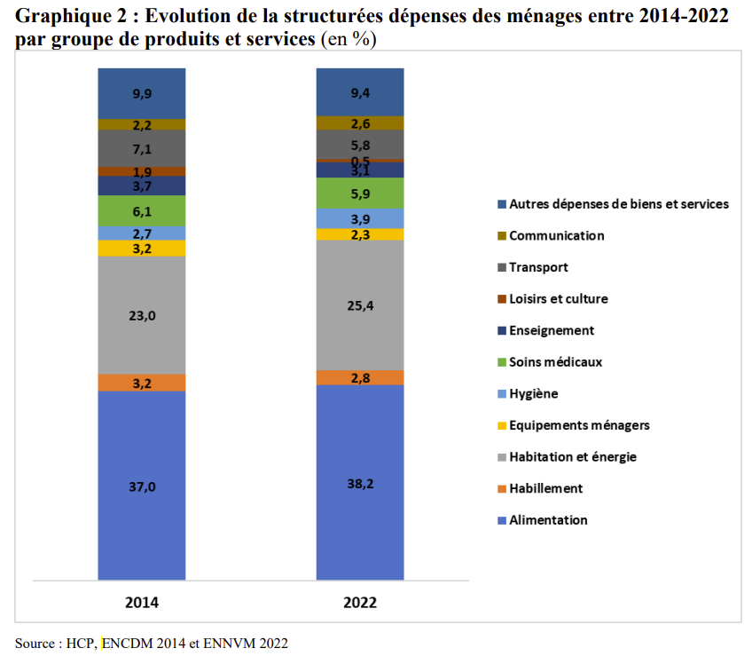

La part de l'alimentation dans le panier de consommation des ménages marocains a augmenté, passant de 37% à 38,2% entre 2014 et 2022, selon le Haut-Commissariat au Plan (HCP). Cette hausse est due à la baisse du pouvoir d'achat des ménages, qui a entraîné une diminution de la consommation de biens et services non alimentaires.

