# Activité parlementaire: 2021-2023

Version du 06 August 2023

L'objectif de ce document est de présenter les graphiques et les données qui seront utilisés pour la partie II du rapport sur l'action parlementaire.

**@abderrahman:**
-  : please build a table :
    - idPerson
    - prenomNomAR_parlement
    - prenomNomAR_elections_ma
    - prenomNom (french)

**@Zineb:**
- Please ask add TOUMAI to add `prenomNomAR` (from parliement website) to questions table
- at the same time, if we can collect prenomNom (french) from parliement website, that would be great

### About the data:
- 'Macro Table' from TOUMAI first sample was used
- MP list and questions list were merged on prenomNomAR.
- Party was added to the MP using same merge + manual data entry by Abderrahman
- We need to fuzzy match prenomNomAR from parliement website to prenomNomAR from elections.ma.
- in the next iteration of the charts, we will use idPerson

### About the charts:
These charts are not final, but the orders of magnitude and the trends are correct
The team has the responsibility to :
- check the charts for accuracy. For each chart, the table data is provided. It can be useful for rajae and for the team to check the data.
- write good titles and comments
- write the performance report (not just a draft)

In the next iteration, we will:
- include any comments from the Rajae
- correct any discrepancies in the data
- if necessary, add more charts and analysis.

## Charts:

### Nombre de questions par parti

Data quality : we need to check why there so few questions by UC.

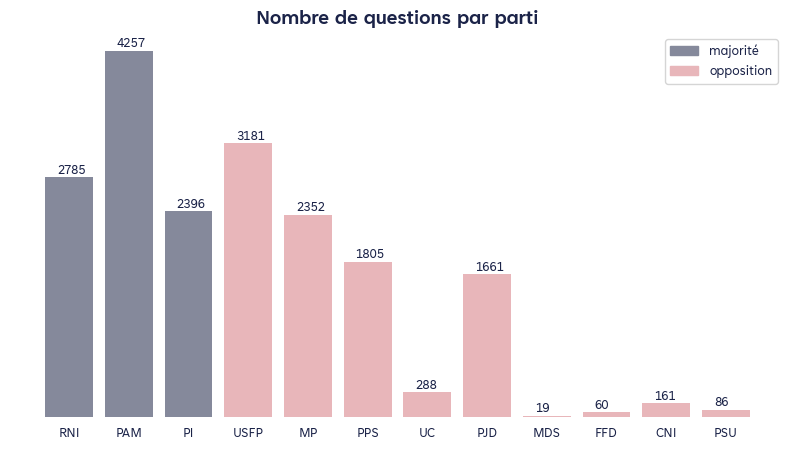

filename : `nbr_questions_parti.png`

| parti   |   nQuestions | majorite_opposition   | color         |
|:--------|-------------:|:----------------------|:--------------|
| RNI     |         2785 | majorite              | blue-tafra-03 |
| PAM     |         4257 | majorite              | blue-tafra-03 |
| PI      |         2396 | majorite              | blue-tafra-03 |
| USFP    |         3181 | opposition            | red-tafra-03  |
| MP      |         2352 | opposition            | red-tafra-03  |
| PPS     |         1805 | opposition            | red-tafra-03  |
| UC      |          288 | opposition            | red-tafra-03  |
| PJD     |         1661 | opposition            | red-tafra-03  |
| MDS     |           19 | opposition            | red-tafra-03  |
| FFD     |           60 | opposition            | red-tafra-03  |
| CNI     |          161 | opposition            | red-tafra-03  |
| PSU     |           86 | opposition            | red-tafra-03  |

@

### Nombre de députés par parti

Juste un rappel, utile pour la suite pour saisir les proportions de chaque parti.

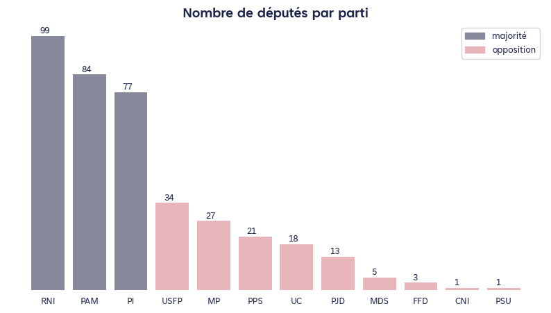

filename : `nb_mp_parti.png`

| parti   |   nMPs | majorite_opposition   | color         |
|:--------|-------:|:----------------------|:--------------|
| RNI     |     99 | majorite              | blue-tafra-03 |
| PAM     |     84 | majorite              | blue-tafra-03 |
| PI      |     77 | majorite              | blue-tafra-03 |
| USFP    |     34 | opposition            | red-tafra-03  |
| MP      |     27 | opposition            | red-tafra-03  |
| PPS     |     21 | opposition            | red-tafra-03  |
| UC      |     18 | opposition            | red-tafra-03  |
| PJD     |     13 | opposition            | red-tafra-03  |
| MDS     |      5 | opposition            | red-tafra-03  |
| FFD     |      3 | opposition            | red-tafra-03  |
| CNI     |      1 | opposition            | red-tafra-03  |
| PSU     |      1 | opposition            | red-tafra-03  |

@:

### Nombre de questions par député - par parti

Parfois j'utilise taux de questions, parfois nombre de questions par député. A harmoniser

Un souci avec le MP, probablement à cause du problème d'orthographe du nom d'Ouzzine

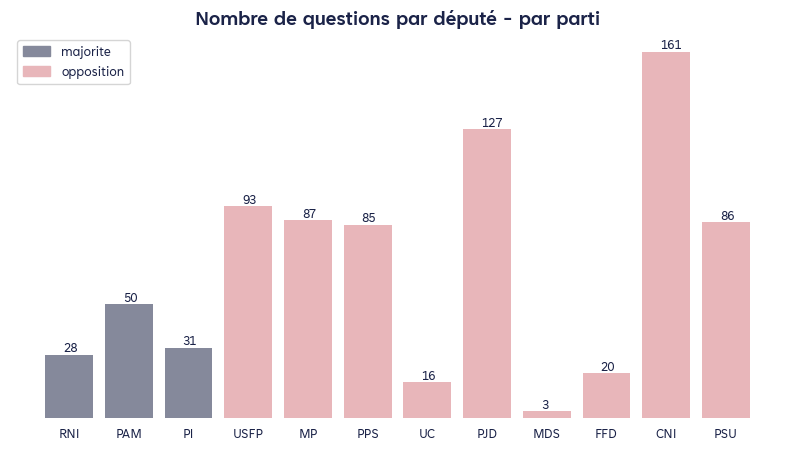

filename : `n_q_mp_parti.png`

| parti   |   nQuestions_byMP | majorite_opposition   | color         |
|:--------|------------------:|:----------------------|:--------------|
| RNI     |                28 | majorite              | blue-tafra-03 |
| PAM     |                50 | majorite              | blue-tafra-03 |
| PI      |                31 | majorite              | blue-tafra-03 |
| USFP    |                93 | opposition            | red-tafra-03  |
| MP      |                87 | opposition            | red-tafra-03  |
| PPS     |                85 | opposition            | red-tafra-03  |
| UC      |                16 | opposition            | red-tafra-03  |
| PJD     |               127 | opposition            | red-tafra-03  |
| MDS     |                 3 | opposition            | red-tafra-03  |
| FFD     |                20 | opposition            | red-tafra-03  |
| CNI     |               161 | opposition            | red-tafra-03  |
| PSU     |                86 | opposition            | red-tafra-03  |

@:

### Nombre total de questions : Majorté / Opposition

En valeur absolue, l'opposition a posé plus de questions que la majorité.

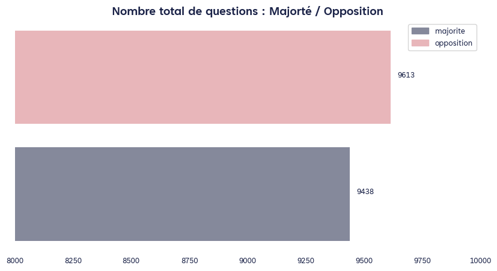

filename : `n_q_opposition_majorite.png`

| majorite_opposition   | color         |   nQuestions |
|:----------------------|:--------------|-------------:|
| majorite              | blue-tafra-03 |         9438 |
| opposition            | red-tafra-03  |         9613 |

@all : notez le changement d'échelle ici, pour rendre la différence plus visible.

### Nombre de questions par député : Majorté / Opposition

Le graphique précédent est confirmé par celui-ci: en moyenne, un député de l'oppostion est plus actif

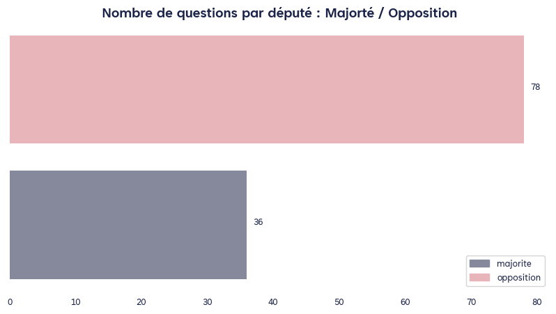

filename : `tx_q_MP_majorite_opposition.png`

| majorite_opposition   |   nQuestions |
|:----------------------|-------------:|
| majorite              |           36 |
| opposition            |           78 |

@rajae:

### Nombre total de questions : par genre

Les femmes ont posé moins de questions que les hommes, mais elles sont aussi bien moins nombreuses

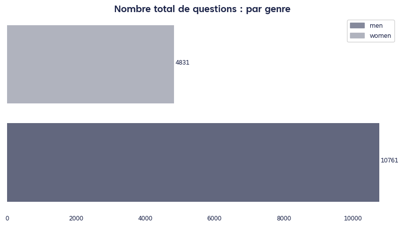

filename : `nbr_q_sexe.png`

| sexe   |   nQuestions |
|:-------|-------------:|
| men    |        10761 |
| women  |         4831 |

@rajae @RF: l'axe x est peut-être inutile ici

### Nombre de députés : par genre

Rappel utile pour pour avoir en tête les proportions. A inclure éventuellement en intro ou avant les autres graphiques sur le genre

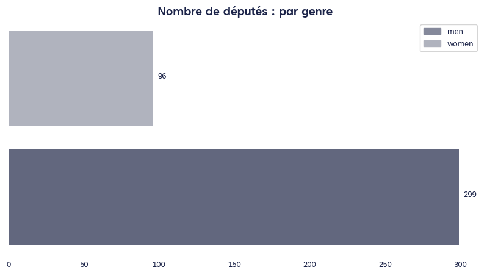

filename : `nbr_mp_sexe.png`

| sexe   |   nbr_MP |
|:-------|---------:|
| men    |      299 |
| women  |       96 |

@rajae: important d'éviter les clichés sur les couleurs ici (red - women, blue - men)
@all : écriture inclusive ou pas ?

### Nombre questions par député.e : par genre

ici écriture incluse, à harmoniser. Aussi, comme précisé plus haut, j'utilise invariablement taux de questions ou nbr de questions par député.e

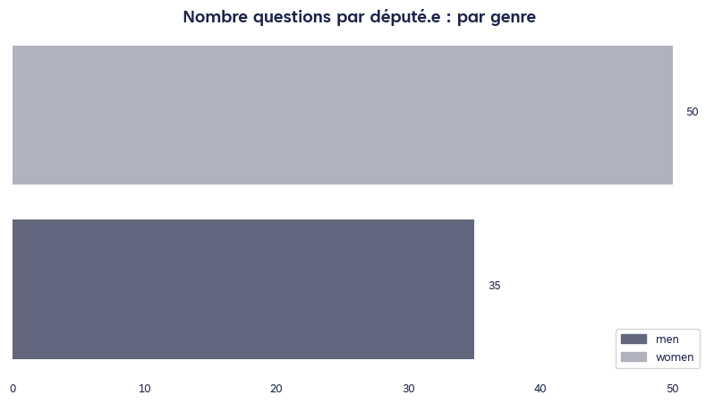

filename : `tx_q_mp_sexe.png`

| sexe   |   txQuestions |
|:-------|--------------:|
| men    |            35 |
| women  |            50 |

@rajae:

### Député.e avec le plus de questions dans chaque parti

Peut-être intéressant de distinguer président du groupe ou pas, et vétéran vs. primo-député.e.
D'autres pistres à creuser : député avec le plus de taux de réponse, député avec les le plus de tx d'engagement, spécialisation député/minsitère etc...

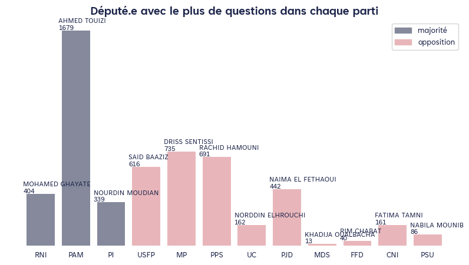

filename : `top_perf_parti.png`

| prenomNom         | parti   |   number_of_questions | majorite_opposition   |
|:------------------|:--------|----------------------:|:----------------------|
| MOHAMED GHAYATE   | RNI     |                   404 | majorite              |
| AHMED TOUIZI      | PAM     |                  1679 | majorite              |
| NOURDIN MOUDIAN   | PI      |                   339 | majorite              |
| SAID BAAZIZ       | USFP    |                   616 | opposition            |
| DRISS SENTISSI    | MP      |                   735 | opposition            |
| RACHID HAMOUNI    | PPS     |                   691 | opposition            |
| NORDDIN ELHROUCHI | UC      |                   162 | opposition            |
| NAIMA EL FETHAOUI | PJD     |                   442 | opposition            |
| KHADIJA OUALBACHA | MDS     |                    13 | opposition            |
| RIM CHABAT        | FFD     |                    40 | opposition            |
| FATIMA TAMNI      | CNI     |                   161 | opposition            |
| NABILA MOUNIB     | PSU     |                    86 | opposition            |

@rajae: clairement la présentation ici est mauvaise. Preneur de tes suggestions. 

### Nombre de réponses du gouvernement aux questions des députés, par parti politique

Faut-il faire un focus PJD + petits partis ? dans une certaine mesure, c'est la seule 'vraie' opposition.

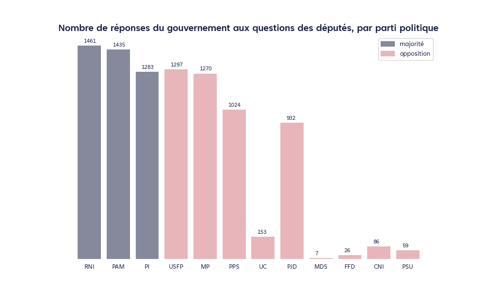

filename : `nbr_reponse_parti.png`

| parti   |   nReponses |   nQuestions | majorite_opposition   | color         |   ratio |
|:--------|------------:|-------------:|:----------------------|:--------------|--------:|
| RNI     |        1461 |         2785 | majorite              | blue-tafra-03 |    52.5 |
| PAM     |        1435 |         4257 | majorite              | blue-tafra-03 |    33.7 |
| PI      |        1283 |         2396 | majorite              | blue-tafra-03 |    53.5 |
| USFP    |        1297 |         3181 | opposition            | red-tafra-03  |    40.8 |
| MP      |        1270 |         2352 | opposition            | red-tafra-03  |    54   |
| PPS     |        1024 |         1805 | opposition            | red-tafra-03  |    56.7 |
| UC      |         153 |          288 | opposition            | red-tafra-03  |    53.1 |
| PJD     |         932 |         1661 | opposition            | red-tafra-03  |    56.1 |
| MDS     |           7 |           19 | opposition            | red-tafra-03  |    36.8 |
| FFD     |          26 |           60 | opposition            | red-tafra-03  |    43.3 |
| CNI     |          86 |          161 | opposition            | red-tafra-03  |    53.4 |
| PSU     |          59 |           86 | opposition            | red-tafra-03  |    68.6 |

@r

### Ratio de réponses du gouvernement aux questions des députés, par parti politique

le PAM pose beaucoup de questions mais reçoit peu de réponses.
Théorie à explorer même en dehors du scope de ce paragraphe/rapport: le PAM parle-t-il pour ne rien dire ? 

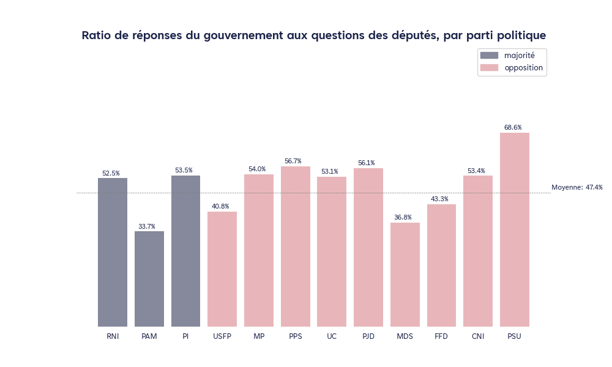

filename : `tx_reponse_mp_parti.png`

| parti   |   nReponses |   nQuestions | majorite_opposition   | color         |   ratio |
|:--------|------------:|-------------:|:----------------------|:--------------|--------:|
| RNI     |        1461 |         2785 | majorite              | blue-tafra-03 |    52.5 |
| PAM     |        1435 |         4257 | majorite              | blue-tafra-03 |    33.7 |
| PI      |        1283 |         2396 | majorite              | blue-tafra-03 |    53.5 |
| USFP    |        1297 |         3181 | opposition            | red-tafra-03  |    40.8 |
| MP      |        1270 |         2352 | opposition            | red-tafra-03  |    54   |
| PPS     |        1024 |         1805 | opposition            | red-tafra-03  |    56.7 |
| UC      |         153 |          288 | opposition            | red-tafra-03  |    53.1 |
| PJD     |         932 |         1661 | opposition            | red-tafra-03  |    56.1 |
| MDS     |           7 |           19 | opposition            | red-tafra-03  |    36.8 |
| FFD     |          26 |           60 | opposition            | red-tafra-03  |    43.3 |
| CNI     |          86 |          161 | opposition            | red-tafra-03  |    53.4 |
| PSU     |          59 |           86 | opposition            | red-tafra-03  |    68.6 |

@rajae:

### Nombre de députés nouveaux et réelus par parti

Pour la plupart des partis, plus de la moitié des députés font leur entrée pour la première fois au Parlement

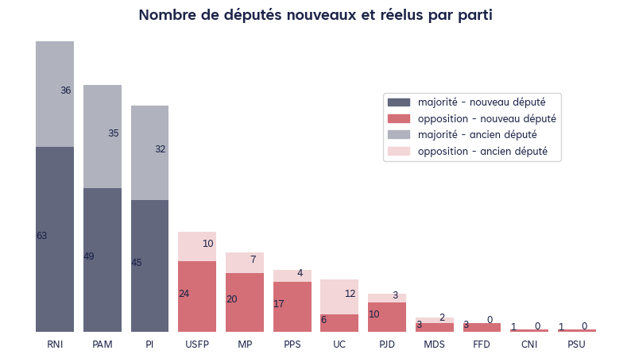

filename : `fresh_veteran_mp.png`

| parti   |   fresh |   veteran |   ratio |
|:--------|--------:|----------:|--------:|
| RNI     |      63 |        36 |      64 |
| PAM     |      49 |        35 |      57 |
| PI      |      45 |        32 |      57 |
| USFP    |      24 |        10 |      71 |
| MP      |      20 |         7 |      74 |
| PPS     |      17 |         4 |      81 |
| UC      |       6 |        12 |      33 |
| PJD     |      10 |         3 |      77 |
| MDS     |       3 |         2 |      60 |
| FFD     |       3 |         0 |     100 |
| CNI     |       1 |         0 |     100 |
| PSU     |       1 |         0 |     100 |

@Raaje : si besoin, on regénère le graph sans data labels

### Nombre de questions par député nouveaux et réelus, par parti

Les nouveaux députés ont tendance à poser plus de questions.

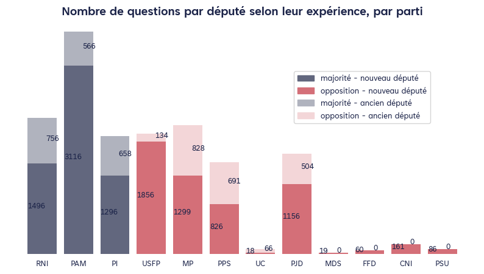

filename : `questions_fresh_veteran_mp.png`

| parti   |   nQuestions | majorite_opposition   | color         |   nbrQuestions_veteran |   nbrQuestions_fresh |
|:--------|-------------:|:----------------------|:--------------|-----------------------:|---------------------:|
| RNI     |         2785 | majorite              | blue-tafra-03 |                    756 |                 1496 |
| PAM     |         4257 | majorite              | blue-tafra-03 |                    566 |                 3116 |
| PI      |         2396 | majorite              | blue-tafra-03 |                    658 |                 1296 |
| USFP    |         3181 | opposition            | red-tafra-03  |                    134 |                 1856 |
| MP      |         2352 | opposition            | red-tafra-03  |                    828 |                 1299 |
| PPS     |         1805 | opposition            | red-tafra-03  |                    691 |                  826 |
| UC      |          288 | opposition            | red-tafra-03  |                     66 |                   18 |
| PJD     |         1661 | opposition            | red-tafra-03  |                    504 |                 1156 |
| MDS     |           19 | opposition            | red-tafra-03  |                      0 |                   19 |
| FFD     |           60 | opposition            | red-tafra-03  |                      0 |                   60 |
| CNI     |          161 | opposition            | red-tafra-03  |                      0 |                  161 |
| PSU     |           86 | opposition            | red-tafra-03  |                      0 |                   86 |

@Raaje : si besoin, on regénère le graph sans data labels.
 - Dans ce cas précis, il faut enlever les zéros (pas de députés anciens chez le PSU, CNI, FFD, MDS).@tous : pour le moment, nombre de questions veteran + fresh n'est pas égal au nombre de questions total.
 - car la table n'est ps encore très propre (en attendant que Abderrahman fournisse les idPerson).

### Taux de questions par député nouveaux et réelus, par parti

Ce graphique montre mieux les tendances : le parti de la majorité privilégient les anciens députés, tandis que l'opposition privilégient les nouveaux députés.
 - A l'exception de L USFP

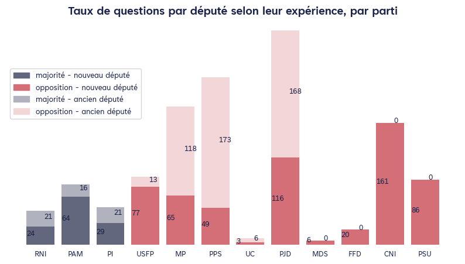

filename : `tx_questions_fresh_veteran_parti.png`

| parti   |   nQuestions | majorite_opposition   | color         |   nbrQuestions_veteran |   nbrQuestions_fresh |
|:--------|-------------:|:----------------------|:--------------|-----------------------:|---------------------:|
| RNI     |         2785 | majorite              | blue-tafra-03 |                    756 |                 1496 |
| PAM     |         4257 | majorite              | blue-tafra-03 |                    566 |                 3116 |
| PI      |         2396 | majorite              | blue-tafra-03 |                    658 |                 1296 |
| USFP    |         3181 | opposition            | red-tafra-03  |                    134 |                 1856 |
| MP      |         2352 | opposition            | red-tafra-03  |                    828 |                 1299 |
| PPS     |         1805 | opposition            | red-tafra-03  |                    691 |                  826 |
| UC      |          288 | opposition            | red-tafra-03  |                     66 |                   18 |
| PJD     |         1661 | opposition            | red-tafra-03  |                    504 |                 1156 |
| MDS     |           19 | opposition            | red-tafra-03  |                      0 |                   19 |
| FFD     |           60 | opposition            | red-tafra-03  |                      0 |                   60 |
| CNI     |          161 | opposition            | red-tafra-03  |                      0 |                  161 |
| PSU     |           86 | opposition            | red-tafra-03  |                      0 |                   86 |

@Raaje @All : même remarques que plus haut.

### Taux de questions par député selon le niveau d'expérience

Les députés novices posent en moyenne 1,5 fois plus de questions que les députés expérimentés.

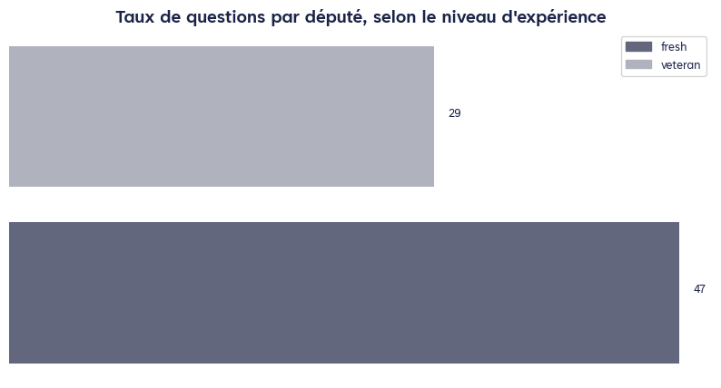

filename : `tx_question_fresh_veteran.png`

| index                |     0 |
|:---------------------|------:|
| fresh                |   242 |
| veteran              |   141 |
| nbrQuestions_fresh   | 11389 |
| nbrQuestions_veteran |  4203 |

### Nombre de questions par région

Les députés de la région deMarrakech-Safi sont ceux qui ont posé le plus de questions, principalement grace à la majoritéLa région où l'opposition a posé le plus de questions est celle de Raba-Salé-Kénitra

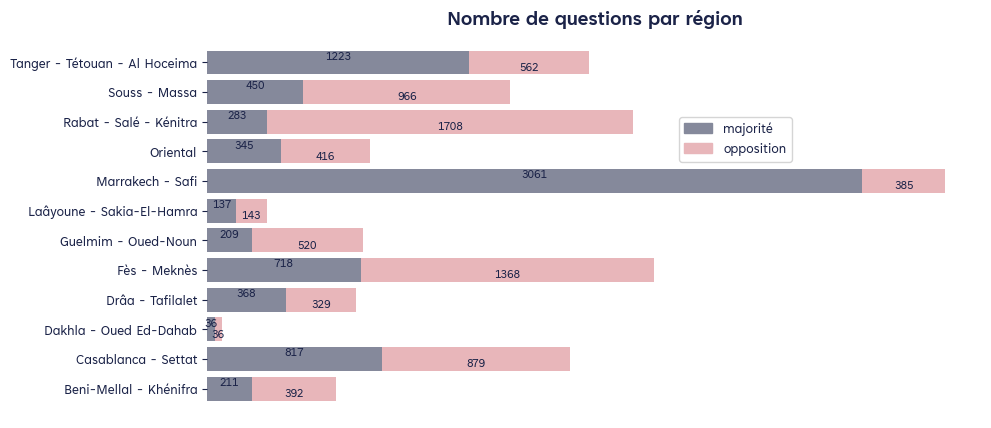

filename : `questions_regions.png`

| region                        |   majorite |   opposition |
|:------------------------------|-----------:|-------------:|
| Beni-Mellal - Khénifra        |        211 |          392 |
| Casablanca - Settat           |        817 |          879 |
| Dakhla - Oued Ed-Dahab        |         36 |           36 |
| Drâa - Tafilalet              |        368 |          329 |
| Fès - Meknès                  |        718 |         1368 |
| Guelmim - Oued-Noun           |        209 |          520 |
| Laâyoune - Sakia-El-Hamra     |        137 |          143 |
| Marrakech - Safi              |       3061 |          385 |
| Oriental                      |        345 |          416 |
| Rabat - Salé - Kénitra        |        283 |         1708 |
| Souss - Massa                 |        450 |          966 |
| Tanger - Tétouan - Al Hoceima |       1223 |          562 |

### Nombre de questions par ministere

Pas de grosses différences dans la répartition des questions par ministère entre majorité et oppositionSauf l'intérieur où l'opposition a posé plus de questions que la majorité

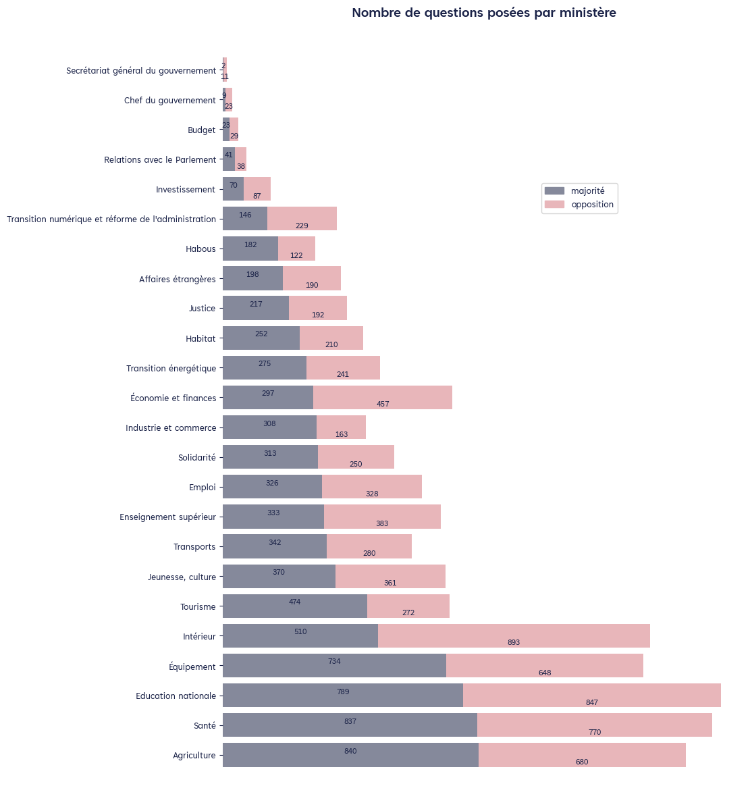

filename : `questions_ministere.png`

| ministere                                                                               |   majorite |   opposition | ministere_fr                                        |
|:----------------------------------------------------------------------------------------|-----------:|-------------:|:----------------------------------------------------|
| الفلاحة والصيد البحري والتنمية القروية والمياه والغابات                                 |        840 |          680 | Agriculture                                         |
| الصحة والحماية الاجتماعية                                                               |        837 |          770 | Santé                                               |
| التربية الوطنية والتعليم الأولي والرياضة                                                |        789 |          847 | Education nationale                                 |
| التجهيز والماء                                                                          |        734 |          648 | Équipement                                          |
| الداخلية                                                                                |        510 |          893 | Intérieur                                           |
| السياحة والصناعة التقليدية والاقتصاد الاجتماعي والتضامني                                |        474 |          272 | Tourisme                                            |
| الشباب والثقافة والتواصل                                                                |        370 |          361 | Jeunesse, culture                                   |
| النقل واللوجيستيك                                                                       |        342 |          280 | Transports                                          |
| التعليم العالي والبحث العلمي والابتكار                                                  |        333 |          383 | Enseignement supérieur                              |
| الإدماج الاقتصادي والمقاولة الصغرى والتشغيل والكفاءات                                   |        326 |          328 | Emploi                                              |
| التضامن والإدماج الاجتماعي والأسرة                                                      |        313 |          250 | Solidarité                                          |
| الصناعة والتجارة                                                                        |        308 |          163 | Industrie et commerce                               |
| الاقتصاد والمالية                                                                       |        297 |          457 | Économie et finances                                |
| الانتقال الطاقي والتنمية المستدامة                                                      |        275 |          241 | Transition énergétique                              |
| إعداد التراب الوطني والتعمير والإسكان وسياسة المدينة                                    |        252 |          210 | Habitat                                             |
| العدل                                                                                   |        217 |          192 | Justice                                             |
| الشؤون الخارجية والتعاون الإفريقي والمغاربة المقيمين بالخارج                            |        198 |          190 | Affaires étrangères                                 |
| الأوقاف والشؤون الإسلامية                                                               |        182 |          122 | Habous                                              |
| الوزارة المنتدبة لدى رئيس الحكومة المكلفة بالانتقال الرقمي وإصلاح الإدارة               |        146 |          229 | Transition numérique et réforme de l'administration |
| الوزارة المنتدبة لدى رئيس الحكومة المكلفة بالاستثمار والتقائية وتقييم السياسات العمومية |         70 |           87 | Investissement                                      |
| الوزارة المنتدبة لدى رئيس الحكومة المكلفة بالعلاقات مع البرلمان                         |         41 |           38 | Relations avec le Parlement                         |
| الوزارة المنتدبة لدى وزيرة الاقتصاد والمالية المكلفة بالميزانية                         |         23 |           29 | Budget                                              |
| رئيس الحكومة                                                                            |          9 |           23 | Chef du gouvernement                                |
| الأمانة العامة للحكومة                                                                  |          2 |           11 | Secrétariat général du gouvernement                 |

@rajae: on pourrait harmoniser les largeurs de barres entre les différents graphiques, if needed.
Les ministères sont classés par ordre croissant de nombre de questions posées par la majorité, on pourrait envisager de les classer autrement.
On peut aussi ajouter le nombre total de questions posées par ministère dans le tableau ci-dessous

### Nombre de Réponses par ministere

L'intérieur a tendance a répodre plus souvent à l'oppostion
SaufPar ailleurs, on ne voit pas de tendances claires, différentes des constats sur les questions

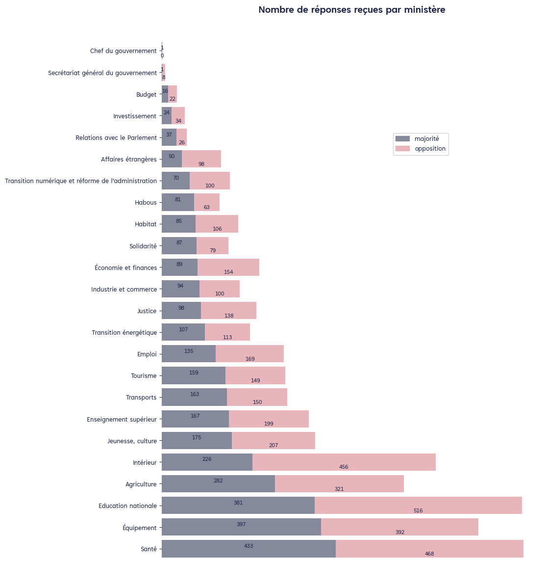

filename : `reponses_ministere.png`

|   index | ministere                                                                               |   majorite |   opposition | ministere_fr                                        |
|--------:|:----------------------------------------------------------------------------------------|-----------:|-------------:|:----------------------------------------------------|
|      14 | الصحة والحماية الاجتماعية                                                               |        433 |          468 | Santé                                               |
|       6 | التجهيز والماء                                                                          |        397 |          392 | Équipement                                          |
|       7 | التربية الوطنية والتعليم الأولي والرياضة                                                |        381 |          516 | Education nationale                                 |
|      17 | الفلاحة والصيد البحري والتنمية القروية والمياه والغابات                                 |        282 |          321 | Agriculture                                         |
|      10 | الداخلية                                                                                |        226 |          456 | Intérieur                                           |
|      13 | الشباب والثقافة والتواصل                                                                |        175 |          207 | Jeunesse, culture                                   |
|       9 | التعليم العالي والبحث العلمي والابتكار                                                  |        167 |          199 | Enseignement supérieur                              |
|      18 | النقل واللوجيستيك                                                                       |        163 |          150 | Transports                                          |
|      11 | السياحة والصناعة التقليدية والاقتصاد الاجتماعي والتضامني                                |        159 |          149 | Tourisme                                            |
|       3 | الإدماج الاقتصادي والمقاولة الصغرى والتشغيل والكفاءات                                   |        135 |          169 | Emploi                                              |
|       5 | الانتقال الطاقي والتنمية المستدامة                                                      |        107 |          113 | Transition énergétique                              |
|      16 | العدل                                                                                   |         98 |          138 | Justice                                             |
|      15 | الصناعة والتجارة                                                                        |         94 |          100 | Industrie et commerce                               |
|       4 | الاقتصاد والمالية                                                                       |         89 |          154 | Économie et finances                                |
|       8 | التضامن والإدماج الاجتماعي والأسرة                                                      |         87 |           79 | Solidarité                                          |
|       0 | إعداد التراب الوطني والتعمير والإسكان وسياسة المدينة                                    |         85 |          106 | Habitat                                             |
|       2 | الأوقاف والشؤون الإسلامية                                                               |         81 |           63 | Habous                                              |
|      20 | الوزارة المنتدبة لدى رئيس الحكومة المكلفة بالانتقال الرقمي وإصلاح الإدارة               |         70 |          100 | Transition numérique et réforme de l'administration |
|      12 | الشؤون الخارجية والتعاون الإفريقي والمغاربة المقيمين بالخارج                            |         50 |           98 | Affaires étrangères                                 |
|      21 | الوزارة المنتدبة لدى رئيس الحكومة المكلفة بالعلاقات مع البرلمان                         |         37 |           26 | Relations avec le Parlement                         |
|      19 | الوزارة المنتدبة لدى رئيس الحكومة المكلفة بالاستثمار والتقائية وتقييم السياسات العمومية |         24 |           34 | Investissement                                      |
|      22 | الوزارة المنتدبة لدى وزيرة الاقتصاد والمالية المكلفة بالميزانية                         |         16 |           22 | Budget                                              |
|       1 | الأمانة العامة للحكومة                                                                  |          1 |            8 | Secrétariat général du gouvernement                 |
|      23 | رئيس الحكومة                                                                            |          1 |            0 | Chef du gouvernement                                |

@rajae: on pourrait harmoniser les largeurs de barres entre les différents graphiques, if needed.
Les ministères sont classés par ordre croissant de nombre de questions posées par la majorité, on pourrait envisager de les classer autrement.
On peut aussi ajouter le nombre total de questions posées par ministère dans le tableau ci-dessous

### Nombre d'engagements pris par ministère

L'intérieur est le seul gros ministère qui prend plus d'engagments auprès de l'opposition.
Intéressant de noter que la santé tend à prendre plus d'engagements aupèrs de la majorité, même si l'opposittion pose plus de questions

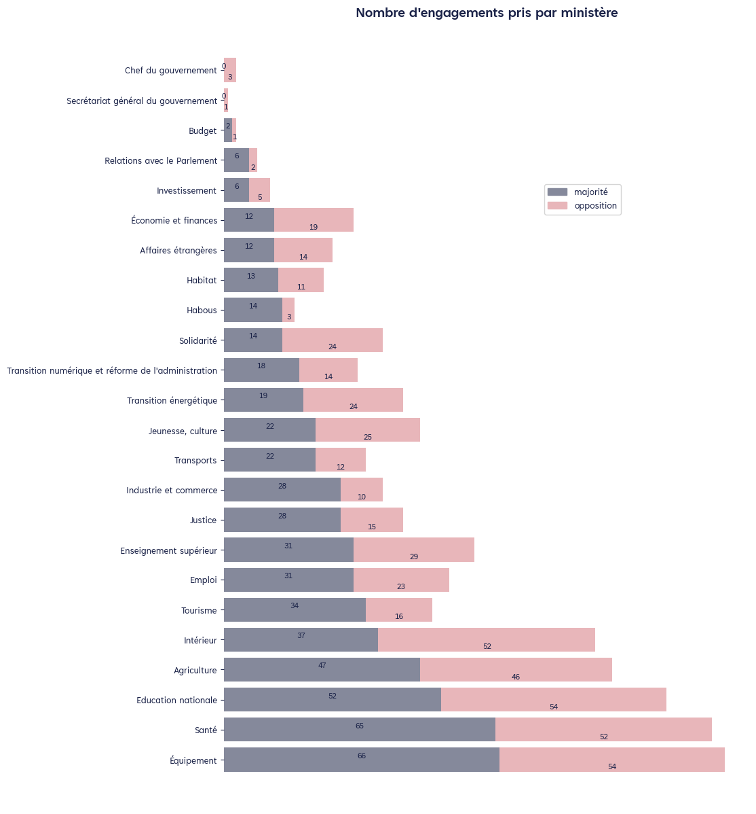

filename : `engagement_ministere.png`

|   index | ministere                                                                               |   majorite |   opposition | ministere_fr                                        |
|--------:|:----------------------------------------------------------------------------------------|-----------:|-------------:|:----------------------------------------------------|
|      14 | الصحة والحماية الاجتماعية                                                               |        433 |          468 | Santé                                               |
|       6 | التجهيز والماء                                                                          |        397 |          392 | Équipement                                          |
|       7 | التربية الوطنية والتعليم الأولي والرياضة                                                |        381 |          516 | Education nationale                                 |
|      17 | الفلاحة والصيد البحري والتنمية القروية والمياه والغابات                                 |        282 |          321 | Agriculture                                         |
|      10 | الداخلية                                                                                |        226 |          456 | Intérieur                                           |
|      13 | الشباب والثقافة والتواصل                                                                |        175 |          207 | Jeunesse, culture                                   |
|       9 | التعليم العالي والبحث العلمي والابتكار                                                  |        167 |          199 | Enseignement supérieur                              |
|      18 | النقل واللوجيستيك                                                                       |        163 |          150 | Transports                                          |
|      11 | السياحة والصناعة التقليدية والاقتصاد الاجتماعي والتضامني                                |        159 |          149 | Tourisme                                            |
|       3 | الإدماج الاقتصادي والمقاولة الصغرى والتشغيل والكفاءات                                   |        135 |          169 | Emploi                                              |
|       5 | الانتقال الطاقي والتنمية المستدامة                                                      |        107 |          113 | Transition énergétique                              |
|      16 | العدل                                                                                   |         98 |          138 | Justice                                             |
|      15 | الصناعة والتجارة                                                                        |         94 |          100 | Industrie et commerce                               |
|       4 | الاقتصاد والمالية                                                                       |         89 |          154 | Économie et finances                                |
|       8 | التضامن والإدماج الاجتماعي والأسرة                                                      |         87 |           79 | Solidarité                                          |
|       0 | إعداد التراب الوطني والتعمير والإسكان وسياسة المدينة                                    |         85 |          106 | Habitat                                             |
|       2 | الأوقاف والشؤون الإسلامية                                                               |         81 |           63 | Habous                                              |
|      20 | الوزارة المنتدبة لدى رئيس الحكومة المكلفة بالانتقال الرقمي وإصلاح الإدارة               |         70 |          100 | Transition numérique et réforme de l'administration |
|      12 | الشؤون الخارجية والتعاون الإفريقي والمغاربة المقيمين بالخارج                            |         50 |           98 | Affaires étrangères                                 |
|      21 | الوزارة المنتدبة لدى رئيس الحكومة المكلفة بالعلاقات مع البرلمان                         |         37 |           26 | Relations avec le Parlement                         |
|      19 | الوزارة المنتدبة لدى رئيس الحكومة المكلفة بالاستثمار والتقائية وتقييم السياسات العمومية |         24 |           34 | Investissement                                      |
|      22 | الوزارة المنتدبة لدى وزيرة الاقتصاد والمالية المكلفة بالميزانية                         |         16 |           22 | Budget                                              |
|       1 | الأمانة العامة للحكومة                                                                  |          1 |            8 | Secrétariat général du gouvernement                 |
|      23 | رئيس الحكومة                                                                            |          1 |            0 | Chef du gouvernement                                |

@rajae: on pourrait harmoniser les largeurs de barres entre les différents graphiques, if needed.
Les ministères sont classés par ordre croissant de nombre d'engagements pris suite à des questions de la majorité, on pourrait envisager de les classer autrement.
On peut aussi ajouter le nombre total d'engagements pris par ministère dans le tableau ci-dessous

